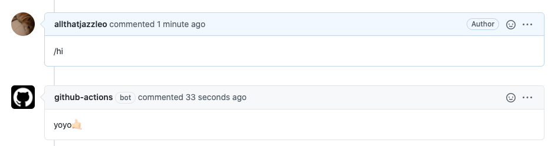

# Pull Request Add Comment - GitHub Actions

## What is it ?

A GitHub action that comments with a given message the pull request linked to the pushed branch.

It can listen to either `pull_request` or `issue_comment` events.
You can even put dynamic data thanks to [Contexts and expression syntax](https://help.github.com/en/actions/automating-your-workflow-with-github-actions/contexts-and-expression-syntax-for-github-actions).

## Usage

```yaml
name: Example

on: 
  pull_request:
  issue_comment:
    types: [created, edited]

jobs:
  example_comment_pr:
    runs-on: ubuntu-latest
    name: An example job to comment a PR
    steps:
      - name: Checkout
        uses: actions/checkout@v1

      - name: Comment PR
        uses: allthatjazzleo/actions-pull-request-add-comment@master
        if: >-
          github.event_name == 'pull_request' || (github.event_name == 'issue_comment' 
          && github.event.comment.body == '/hi' && github.actor == 'allthatjazzleo' )
        with:
          message: 'yoyo🤙🏻'
          # message: "echo ${{ github.event.comment.body }}' dynamic message
          GITHUB_TOKEN: ${{ secrets.GITHUB_TOKEN }}
```

<p align="center">
  
</p>

:information_source: : Make sure to listen to `pull_request` or `issue_comment` events. 
Otherwise, it will not be able to comment the PR and you'll have an error. 

### Build 

The build steps transpiles the `src/main.ts` to `lib/main.js` which is used in the Docker container. 
It is handled by Typescript compiler. 

```sh
$ npm run build
```